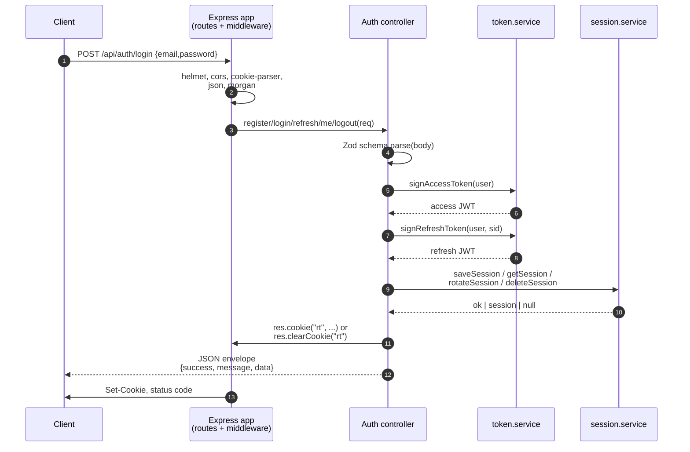
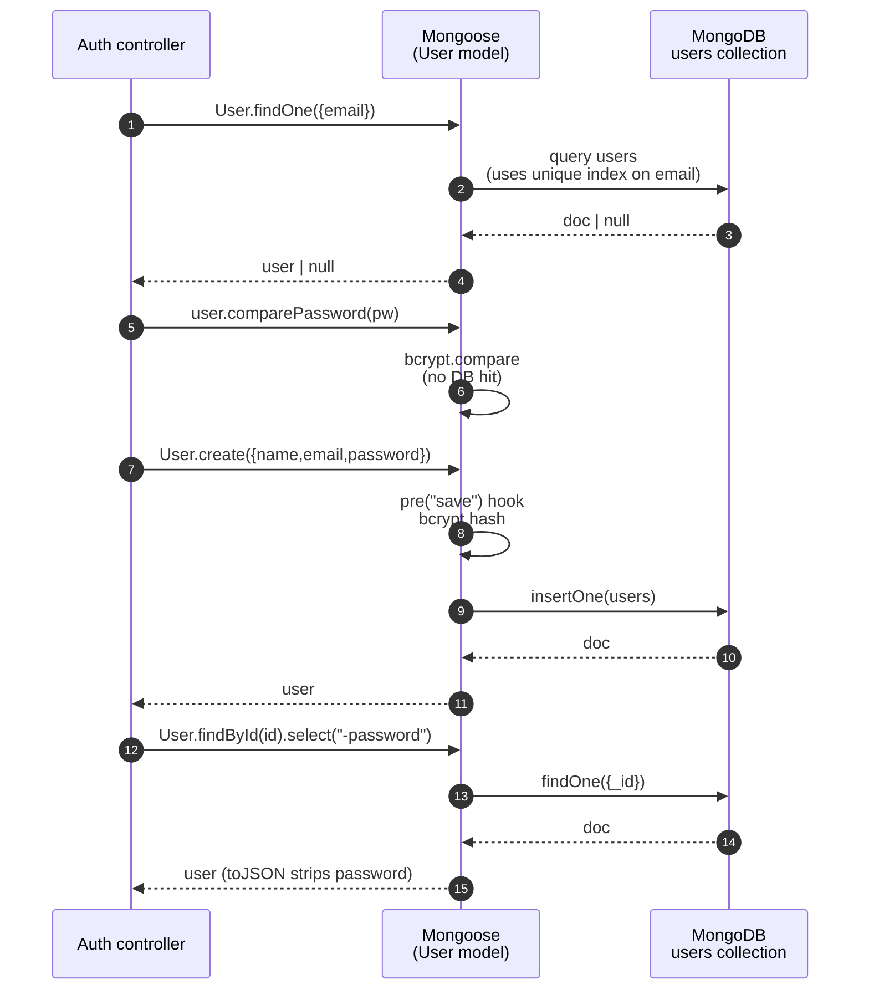
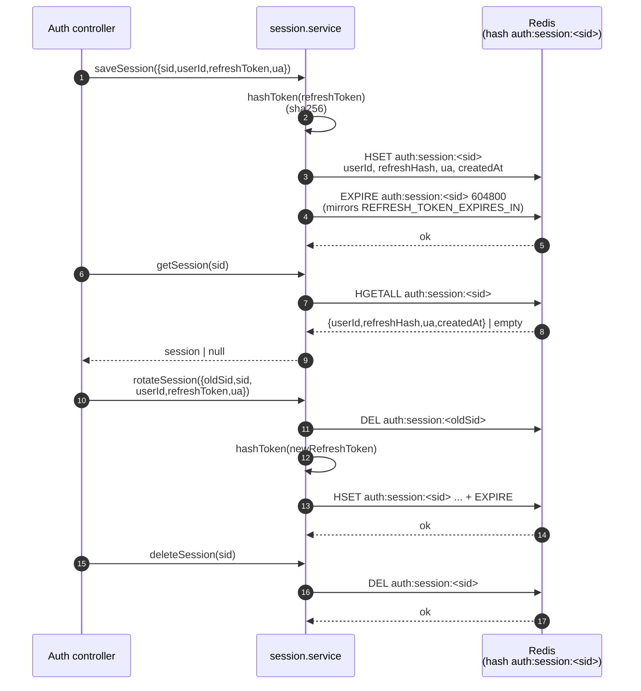

# MERN E-commerce — Backend

Express 5 + Mongoose 9 + Zod 4 backend. API documentation is written
inline next to each route using JSDoc `@openapi` blocks, and served
by Swagger UI at `/api-docs`.

## Quick start

```bash
# 1. start MongoDB + UI via docker compose
npm run db:up

# 2. install deps
npm install

# 3. run the API on http://localhost:5000
npm run dev
```

When the server starts it prints a banner with the URLs for the API,
Swagger UI, the raw OpenAPI JSON, and the Mongo Express UI
(`teacher` / `teacher123`).

## Scripts

| Command           | What it does                                          |
|-------------------|-------------------------------------------------------|
| `npm run dev`     | Start the server with nodemon                         |
| `npm run start`   | Start the server without nodemon                      |
| `npm run db:up`   | Start mongo + mongo-express containers                |
| `npm run db:down` | Stop them                                             |
| `npm run db:logs` | Tail mongo logs                                       |
| `npm run check`   | `node --check server.js` smoke check                  |

## Useful URLs

- API base: `http://localhost:5000`
- Swagger UI: `http://localhost:5000/api-docs`
- OpenAPI JSON: `http://localhost:5000/openapi.json`
- Mongo Express: `http://localhost:8081` (user `teacher`, pass `teacher123`)

## How docs work

The OpenAPI definition lives in two places and only two:

1. **`src/docs/swagger.js`** — the OpenAPI metadata (info, server,
   bearer-auth scheme, shared response envelopes) and the glob of
   files swagger-jsdoc scans for JSDoc.
2. **`@openapi` JSDoc blocks** placed directly above each
   `router.<method>(...)` call in `src/routes/*.js`.

The spec is **generated at boot time** — there is no `openapi.json`
to commit and no build step to remember. Restart the server, and
the spec reflects whatever the route files say.

## Adding a documented endpoint

There is exactly **one rule**: each `router.<method>(path, ...)` line
must have a JSDoc `@openapi` block directly above it. That's it.

```js
// src/routes/auth.routes.js

/**
 * @openapi
 * /api/auth/login:
 *   post:
 *     tags: [Auth]
 *     summary: Authenticate and receive a JWT
 *     requestBody:
 *       required: true
 *       content:
 *         application/json:
 *           schema:
 *             type: object
 *             required: [email, password]
 *             properties:
 *               email:    { type: string, format: email }
 *               password: { type: string, minLength: 6 }
 *     responses:
 *       200:
 *         description: Login successful.
 *         content:
 *           application/json:
 *             schema:
 *               allOf:
 *                 - $ref: "#/components/schemas/SuccessEnvelope"
 *                 - type: object
 *                   properties:
 *                     data:
 *                       type: object
 *                       properties:
 *                         token: { type: string }
 *                         user:  { $ref: "#/components/schemas/User" }
 *       401:
 *         description: Invalid credentials.
 *         content:
 *           application/json:
 *             schema: { $ref: "#/components/schemas/ErrorEnvelope" }
 */
router.post("/login", login);
```

For endpoints that need a JWT, add `security: [{ bearerAuth: [] }]`
at the operation level; the padlock icon in Swagger UI will light
up automatically.

For new shared component schemas (a new resource type, a new envelope,
etc.), add them under `components.schemas` in `src/docs/swagger.js`
and reference them with `$ref`.

## Source-of-truth map

- **OpenAPI metadata, schemas, security**: `src/docs/swagger.js`
- **Endpoint docs**: JSDoc blocks in `src/routes/*.js`
- **Runtime validation**: Zod schemas in `src/controllers/*.controller.js`

## How requests flow

The diagram below shows how a request travels through the running
system — Express, controllers/services, Mongo, and Redis — for each
auth lifecycle event. Arrows are top-down; labels on arrows are the
action or payload being moved.


### Reading the diagram

- **Bootstrap** is one-time at process start: Mongo is connected
  eagerly (the process exits if it fails), Redis is connected
  lazily with retries so missing `docker compose up -d` doesn't
  crash boot.
- **Register** writes to Mongo only. No session, no Redis, no JWT.
- **Login** is the only path that touches **all three** stores at
  once: Mongo for the user record, Redis for the session hash
  keyed by `sid`, and the response carries an HttpOnly refresh
  cookie alongside a short-lived access JWT.
- **Me** validates the access JWT, then re-reads the user from
  Mongo so deleted users cannot keep using a still-valid token.
- **Refresh** is currently a stub — the intended flow (shown in
  the note on the diagram) verifies the refresh JWT, looks up
  the session in Redis, rotates it, and mints a new access
  token + cookie.
- **Logout** is best-effort: it decodes the cookie without
  verifying the signature, deletes the matching session from
  Redis if present, and clears the cookie.

## Components: what each one actually does

The diagrams above show *what happens* during a request. This section
shows **what each component owns and which wire-level operations it
performs**. Three diagrams, one per backend piece.

### Backend (Express + controllers + services)

The backend is a stateless HTTP layer. It owns **request shape**
(validation, routing, error formatting), **token signing**, and
**business rules**. It does not own user records or session records —
both of those live in Mongo and Redis respectively.



**Wire-level ops the backend performs**

| Op | Library | Target |
| --- | --- | --- |
| HTTP parse | `express.json()` + `cookie-parser` | request body, cookies |
| Validation | `zod` | request DTO |
| JWT sign | `jsonwebtoken.sign` | in-memory secret (`JWT_SECRET`, `REFRESH_TOKEN_SECRET`) |
| JWT verify | `jsonwebtoken.verify` | in-memory secret |
| Hash | `crypto.createHash("sha256")` | refresh token bytes |
| Session | delegates to `session.service` | Redis |
| Bcrypt | `bcryptjs` | password vs stored hash (no DB hit) |

> **Why this matters:** everything in this column is **stateless** and
> **in-process**. Killing the server loses nothing — Mongo and Redis
> are the only sources of truth.

### MongoDB (durable storage)

MongoDB owns the **User** collection — the only durable business
record in the system. It is reached **only** through Mongoose models
from controllers. No session, token, or cookie data ever lives here.



**MongoDB operations in this app**

| Op | When | Index used |
| --- | --- | --- |
| `findOne({email})` | `register` (uniqueness check), `login` | unique index on `email` |
| `insertOne` | `register` (after bcrypt hash) | writes implicit `_id` |
| `findById(id)` | `me`, `refresh` | implicit `_id` |
| `comparePassword` | `login` (in-process) | none — bcrypt against stored hash |
| `pre("save")` hook | `User.create` | none — pure CPU |

> **Why Mongo and not Redis:** passwords are **durable**, **slow to
> re-derive**, and only need lookup-by-email — a perfect fit for an
> index-backed RDBMS-shaped store. Redis is volatile-by-design; the
> session store is fine to lose on a Redis restart because the worst
> case is a forced re-login.

### Redis (session store + cache)

Redis owns **session records** keyed by the refresh JWT's `sid`
claim. It is reached only via `session.service.js`. Login writes a
hash with a TTL; every subsequent request that involves a session
reads it; rotation deletes the old key and writes a new one.



**Key shape**

```
auth:session:<sid>          (Redis hash)
  userId        -> ObjectId-as-string
  refreshHash   -> sha256(refreshToken)
  ua            -> User-Agent at login
  createdAt     -> ISO timestamp
  TTL           -> 7d (mirrors REFRESH_TOKEN_EXPIRES_IN)
```

**Redis ops in this app**

| Op | When | Purpose |
| --- | --- | --- |
| `HSET` + `EXPIRE` | login | create session row + self-destruct timer |
| `HGETALL` | refresh, `me`-adjacent flows | prove the cookie matches a live session |
| `DEL` (old) + `HSET` + `EXPIRE` | refresh | rotate (one-shot token) |
| `DEL` | logout | revoke |

> **Why hash, not string:** we want to store several fields under one
> `sid` without serializing JSON in user code. `HGETALL` returns the
> whole record in one call.
>
> **Why TTL:** Redis is volatile-by-design. A fixed-window TTL means
> abandoned sessions **cannot outlive** their refresh JWT's `exp` —
> which is the property that lets you stop worrying about cleanup.

### How the three pieces connect

```mermaid
sequenceDiagram
    autonumber
    participant C as Client
    participant B as Backend<br/>(Express + services)
    participant DB as MongoDB
    participant R as Redis

    C->>B: HTTP request
    B->>DB: durable reads/writes<br/>(User collection)
    B->>R: session reads/writes<br/>(auth:session:<sid>)
    B-->>C: Set-Cookie + JSON response

    note over DB: source of truth for users
    note over R: source of truth for active sessions
    note over B: stateless; signs/verifies JWTs,<br/>calls both stores
```